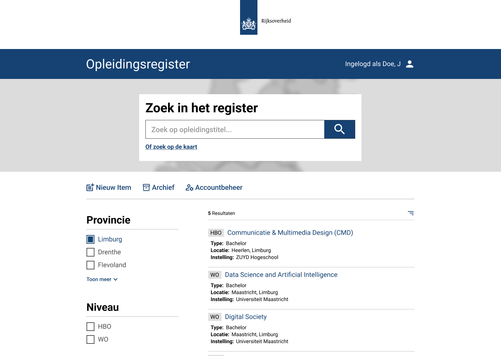

# IT Education Navigator

Web application created for viewing and maintaining information on IT educational courses in the Netherlands. This project was conducted for the Software Engineering course in collaboration with 3 other Computing Science students.

## Project Overview

IT Education Navigator is a full-stack web application that helps users discover and compare IT education options in the Netherlands. The platform provides searchable course data and secure functionality for maintaining course information.

This project demonstrates practical software engineering in a team setting: translating requirements into a working product, designing and integrating REST APIs, and building a maintainable codebase with automated tests.

## What this project shows

- Full-stack development using a React frontend and Spring Boot backend
- API design and implementation with layered architecture (controller, service, repository)
- Authentication and authorization with Spring Security and JWT
- Database design and migrations with PostgreSQL and Flyway
- Test-driven quality practices using JUnit, Mockito, and React Testing Library
- Team collaboration through Git-based workflows in a 4-person development team

## Tech stack

- Frontend: React, React Router, MUI, Axios
- Backend: Java 17, Spring Boot, Spring Security, Spring Data JPA
- Data: PostgreSQL, Flyway migrations
- Tooling and quality: Gradle, JUnit, Mockito, JaCoCo, SonarQube

### Example snapshot

  

